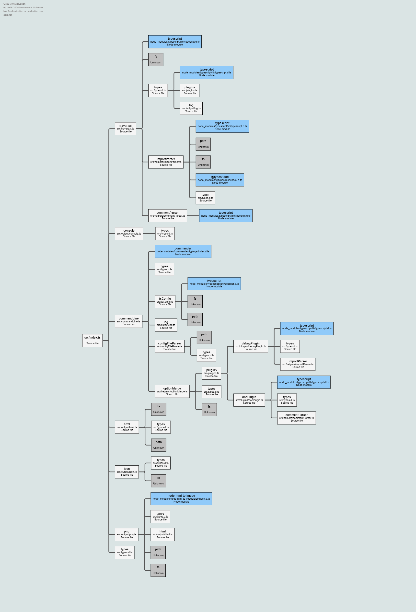

# ts-insp

Tool for inspecting typescript project imports.

This is meant for documenting existing code and it's dependencies. Just something I needed IRL and couldn't find suitable solutions. Asked some pointers from ChatGPT and seemed like a cool thing to do. So here we are...

Currently only these file formats are supported but it all depends on what the typescript is able to parse:

-   .ts
-   .js
-   .tsx
-   .jsx
-   .d.ts

## Installing and running

### yarn

Install the dev dependency

```sh
yarn add -D ts-insp
```

Run the script

```sh
yarn ts-insp --help
```

### npx

You can run the tool without installing dependency:

```sh
npx ts-insp --help
```

## Example Output



## Configuration

Create configuration file e.g. `./ts-insp.config.ts`. All options are supported in the configuration file (except plugins at the moment).

Example:

```ts
import { InspOptions } from "ts-insp";

const config: Partial<InspOptions> = {
    // Debug logs
    verbose: false,
    // Supported types. js, ts, jsx, tsx ja d.ts files are officially supported. Some other typescript
    // friendly files might be too.
    supportedTypes: ["tsx", "ts", "d.ts"],
    // Entry point where traversing starts
    file: "App.tsx",
    // By default node modules are not traversed. Can be enabled but feature is experimental
    traverseNodeModules: false,
    // By default retraversing is disabled. This defines whether same module is processed again when
    // encountered during traversing. If the amount of iterations for traversing is too high
    // circular dependencies will be a problem. Use with caution.
    retraverse: false,
    // Output format. Supported types are console, json, png, html
    format: ["console", "png"],
    // html and png formatting options. More information later
    formatOptions: {
        png: {
            outputPath: "docs",
            outputName: "DependencyTree",
            template: "d3dependencyTree",
            customStyles: "body { width: 2200px !important; height: 100% !important; }",
            slugs: {
                diagramWidth: 2000,
                diagramHeight: 2000,
                maxRectWidth: 280,
            },
        },
    },
    // Not supported in config file. Experimental feature which can be enabled from command line.
    plugins: [],
};

export default config;
```

After the configuration file has been created you can run the tool with following command:

```sh
yarn ts-insp -c ts-insp.config.ts
```

Command line configuration instructions can be read with following command. Command line options will overwrite the configuration file if provided.

```sh
yarn ts-insp --help
```

## Future improvements

-   ~~Configuration file~~
-   ~~Option to discard the child imports if the dependant file has already been traversed. Otherwise there would be a lot of noice~~
-   ~~Would be nice to convert relative imports to absolute ones. Just need the root folder~~
-   ~~Exporting to different formats (JSON, Image, HTML, PNG)~~
-   ~~Take tsconfig.json configuration in to account. aliases, rootDir, etc...~~
-   ~~Unit tests :)~~
-   ~~Make it runnable with npx. Might work already, not sure...~~
-   ~~Publish it, real versions~~
-   ~~Alternative to gojs :(~~
-   More comprehensive unit tests :)
-   Export whole project (user gives the folder)
-   Maybe add more functionality for it. Check if there are unused dependencies in the package.json
