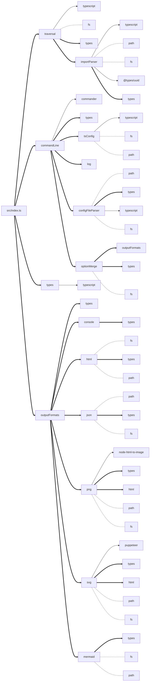

```mermaid
graph LR
root[src/index.ts] ==> e984e1aa-5065-4710-9f6c-50bf1d4cea3c[traversal]
e984e1aa-5065-4710-9f6c-50bf1d4cea3c[traversal] --> 25d90830-3435-49ea-9136-55708ae4ead1[typescript]
e984e1aa-5065-4710-9f6c-50bf1d4cea3c[traversal] -.- b6430ed2-e2c8-4ef4-b2f6-6632b3aaccca[fs]
e984e1aa-5065-4710-9f6c-50bf1d4cea3c[traversal] ==> 8de43ee4-2721-4efa-b9e1-d6034a0a90ec[types]
e984e1aa-5065-4710-9f6c-50bf1d4cea3c[traversal] ==> f18420e7-3d09-4dc1-82e0-22c5a42f1ee6[importParser]
f18420e7-3d09-4dc1-82e0-22c5a42f1ee6[importParser] --> 833e70b7-38d7-46a9-b2c7-0252349f8ecf[typescript]
f18420e7-3d09-4dc1-82e0-22c5a42f1ee6[importParser] -.- 2170759a-4da6-4e3e-a1af-5105eb9e7be0[path]
f18420e7-3d09-4dc1-82e0-22c5a42f1ee6[importParser] -.- 76bb4ea8-d0f6-428a-81d0-a7e98443f02b[fs]
f18420e7-3d09-4dc1-82e0-22c5a42f1ee6[importParser] --> 5450cc31-ba04-47bb-b5f8-a1fc4de41fbe[#64;types/uuid]
f18420e7-3d09-4dc1-82e0-22c5a42f1ee6[importParser] ==> 62cb805d-af06-4938-a5b2-154134379380[types]
root[src/index.ts] ==> 2c981548-2b62-4f43-8dfe-0d9def20213f[commandLine]
2c981548-2b62-4f43-8dfe-0d9def20213f[commandLine] --> 7f107277-d397-4a79-99b7-d7a361ee9f68[commander]
2c981548-2b62-4f43-8dfe-0d9def20213f[commandLine] ==> c2b5d14c-5a62-41d5-9834-80fedcce55d5[types]
2c981548-2b62-4f43-8dfe-0d9def20213f[commandLine] ==> a6ae9a64-3a84-483f-9c69-e512d2e7a55e[tsConfig]
a6ae9a64-3a84-483f-9c69-e512d2e7a55e[tsConfig] --> f4c43d48-300e-47ae-8a13-c4d557ffb8b6[typescript]
a6ae9a64-3a84-483f-9c69-e512d2e7a55e[tsConfig] -.- f40d71a4-3d8a-4e2f-a9a6-190a577327a9[fs]
a6ae9a64-3a84-483f-9c69-e512d2e7a55e[tsConfig] -.- 56c1e0d9-da0e-4c03-86ed-beb2fcf821fb[path]
2c981548-2b62-4f43-8dfe-0d9def20213f[commandLine] ==> cd33cb04-85a5-467b-a377-19929ee9e940[log]
2c981548-2b62-4f43-8dfe-0d9def20213f[commandLine] ==> a15ed99d-b3fa-4492-831f-f5361fb7330c[configFileParser]
a15ed99d-b3fa-4492-831f-f5361fb7330c[configFileParser] -.- 7d88c43b-8455-42c4-bbc4-46f19be524c9[path]
a15ed99d-b3fa-4492-831f-f5361fb7330c[configFileParser] ==> 399c1e49-8b01-4c3d-bf56-f25d0c50758c[types]
a15ed99d-b3fa-4492-831f-f5361fb7330c[configFileParser] --> a348bfdf-acb1-4b71-b2b2-45ee4c116c7b[typescript]
a15ed99d-b3fa-4492-831f-f5361fb7330c[configFileParser] -.- 6d8b475f-2432-4074-bccc-5ca28473ced7[fs]
2c981548-2b62-4f43-8dfe-0d9def20213f[commandLine] ==> 70467238-75b1-4f9f-ac53-b0adb8d28bfe[optionMerge]
70467238-75b1-4f9f-ac53-b0adb8d28bfe[optionMerge] ==> 0152d878-9d09-4807-beed-83bc7b554145[outputFormats]
70467238-75b1-4f9f-ac53-b0adb8d28bfe[optionMerge] ==> 6550227d-1118-4cf9-9c4c-fb4b72416003[types]
70467238-75b1-4f9f-ac53-b0adb8d28bfe[optionMerge] -.- c47449a0-4828-4e92-a4be-3bddf0d4cc3b[fs]
root[src/index.ts] ==> 8b52b145-1e15-4260-8a99-10988be72148[types]
8b52b145-1e15-4260-8a99-10988be72148[types] --> d2d3b9b4-6cef-4743-97e4-81c40ab20157[typescript]
root[src/index.ts] ==> 62644cb8-246d-4e29-8ef2-d86f38cee683[outputFormats]
62644cb8-246d-4e29-8ef2-d86f38cee683[outputFormats] ==> 8cd5cdba-180c-433d-bbd4-975df94ccfa7[types]
62644cb8-246d-4e29-8ef2-d86f38cee683[outputFormats] ==> b98d7aae-f335-4d46-bcb3-b91139ac97d6[console]
b98d7aae-f335-4d46-bcb3-b91139ac97d6[console] ==> 3a0bea73-bb95-4a36-a502-2bbc772123cb[types]
62644cb8-246d-4e29-8ef2-d86f38cee683[outputFormats] ==> 6686c68a-a3a8-4067-9415-ccaa6305ad34[html]
6686c68a-a3a8-4067-9415-ccaa6305ad34[html] -.- 4d43fe8b-ea53-423b-a1d6-a76471969747[fs]
6686c68a-a3a8-4067-9415-ccaa6305ad34[html] ==> 73be2b63-d38f-4c27-ba48-18210b799c4d[types]
6686c68a-a3a8-4067-9415-ccaa6305ad34[html] -.- 94258e45-9380-4e86-8cd2-8f209b4ff91d[path]
62644cb8-246d-4e29-8ef2-d86f38cee683[outputFormats] ==> 04cdfe55-929d-4fe7-aba1-4d33df752cc5[json]
04cdfe55-929d-4fe7-aba1-4d33df752cc5[json] -.- a3a8296e-14b3-416c-9c03-846a27fece6f[path]
04cdfe55-929d-4fe7-aba1-4d33df752cc5[json] ==> 73b90e46-b4ca-4c40-b119-abdd671ee2cd[types]
04cdfe55-929d-4fe7-aba1-4d33df752cc5[json] -.- b9ffb9e2-6d9f-4cdc-b47f-aec6326ed05a[fs]
62644cb8-246d-4e29-8ef2-d86f38cee683[outputFormats] ==> 269112c0-3c75-46b0-95e5-161eae373388[png]
269112c0-3c75-46b0-95e5-161eae373388[png] --> 12303c32-9a88-4fa6-8a21-80aa919756f1[node-html-to-image]
269112c0-3c75-46b0-95e5-161eae373388[png] ==> 54df45c6-6be3-4bb3-979e-c8b2c875cb94[types]
269112c0-3c75-46b0-95e5-161eae373388[png] ==> 0dcec2c0-83f1-4630-abaf-da77170202a2[html]
269112c0-3c75-46b0-95e5-161eae373388[png] -.- 0414dc7d-34a1-4cef-a7fe-347d89ac2418[path]
269112c0-3c75-46b0-95e5-161eae373388[png] -.- 1f430b98-72be-447a-91b6-0cb0bd973828[fs]
62644cb8-246d-4e29-8ef2-d86f38cee683[outputFormats] ==> 3dba48fb-4bd7-4591-a5ce-2d30b84b145b[svg]
3dba48fb-4bd7-4591-a5ce-2d30b84b145b[svg] --> e432c406-aa3e-4609-9a71-3e6355e5b3b6[puppeteer]
3dba48fb-4bd7-4591-a5ce-2d30b84b145b[svg] ==> 8150751d-a4a9-4b2a-a9c5-738e3fb50d3f[types]
3dba48fb-4bd7-4591-a5ce-2d30b84b145b[svg] ==> ea2e552b-22c9-447d-b666-022fc336c775[html]
3dba48fb-4bd7-4591-a5ce-2d30b84b145b[svg] -.- 642352e0-77e5-43ca-9bc2-4c3832229cff[path]
3dba48fb-4bd7-4591-a5ce-2d30b84b145b[svg] -.- c4ed4ced-74ae-42ec-8e64-8fb593dccd72[fs]
62644cb8-246d-4e29-8ef2-d86f38cee683[outputFormats] ==> 731ee97c-c6e3-4cc2-a207-68ac723cde68[mermaid]
731ee97c-c6e3-4cc2-a207-68ac723cde68[mermaid] ==> 67f51adf-e870-4a3c-b15e-5b7414eb74b9[types]
731ee97c-c6e3-4cc2-a207-68ac723cde68[mermaid] -.- 8862a60a-0b43-4a5e-bf94-8639cbf22bdd[fs]
731ee97c-c6e3-4cc2-a207-68ac723cde68[mermaid] -.- 666544e9-16b0-4504-9240-2876ebc920a8[path]
```