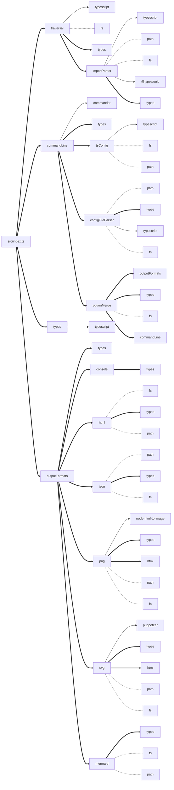

```mermaid
graph LR
root[src/index.ts] ==> f4708f94-9638-4032-a550-383acc8b7adb[traversal]
f4708f94-9638-4032-a550-383acc8b7adb[traversal] --> 99e6239f-2afe-4973-8209-07c926ff0af9[typescript]
f4708f94-9638-4032-a550-383acc8b7adb[traversal] -.- c1671098-e355-40fe-bc2b-7e99e86d68fe[fs]
f4708f94-9638-4032-a550-383acc8b7adb[traversal] ==> 77be151a-fd35-4338-9b15-300cac769871[types]
f4708f94-9638-4032-a550-383acc8b7adb[traversal] ==> ba2f326e-ca47-4152-81fe-e9e86e25cc5e[importParser]
ba2f326e-ca47-4152-81fe-e9e86e25cc5e[importParser] --> cca4577f-7c11-4213-ac0c-1253ce7a9aeb[typescript]
ba2f326e-ca47-4152-81fe-e9e86e25cc5e[importParser] -.- c0e1882e-3195-4bdc-89df-ee9c91b2739b[path]
ba2f326e-ca47-4152-81fe-e9e86e25cc5e[importParser] -.- 9f99dfeb-31dd-4375-b495-6f8f07188e7b[fs]
ba2f326e-ca47-4152-81fe-e9e86e25cc5e[importParser] --> 56c21eee-131b-4690-8713-7030e0c7ffce[#64;types/uuid]
ba2f326e-ca47-4152-81fe-e9e86e25cc5e[importParser] ==> 968f4d52-3c86-43f7-8626-8a068ca409ce[types]
root[src/index.ts] ==> 6a9babc0-8aa6-40fd-99bd-f684c5d727b5[commandLine]
6a9babc0-8aa6-40fd-99bd-f684c5d727b5[commandLine] --> 262299c6-93db-4675-b80e-1a9f2fec44d8[commander]
6a9babc0-8aa6-40fd-99bd-f684c5d727b5[commandLine] ==> e3203a77-5cbe-4bb3-956c-293e830d0a0a[types]
6a9babc0-8aa6-40fd-99bd-f684c5d727b5[commandLine] ==> c93bf266-8d74-4f8d-8887-42ed1fe056a9[tsConfig]
c93bf266-8d74-4f8d-8887-42ed1fe056a9[tsConfig] --> c503ae0e-684e-4c19-bae0-0fe8b9a14cfe[typescript]
c93bf266-8d74-4f8d-8887-42ed1fe056a9[tsConfig] -.- d96b521c-eb42-4d02-acf1-be8e1dd294bf[fs]
c93bf266-8d74-4f8d-8887-42ed1fe056a9[tsConfig] -.- d0029fdc-2b94-4ce9-a16b-0b4616a3319a[path]
6a9babc0-8aa6-40fd-99bd-f684c5d727b5[commandLine] ==> 3c542139-243a-4366-af7a-8ca6358b9743[configFileParser]
3c542139-243a-4366-af7a-8ca6358b9743[configFileParser] -.- a2654c79-7576-4705-b256-49f73cc491c8[path]
3c542139-243a-4366-af7a-8ca6358b9743[configFileParser] ==> 66b90360-0697-4e1c-acc4-48923e1c3cc2[types]
3c542139-243a-4366-af7a-8ca6358b9743[configFileParser] --> 05935560-49d3-41d0-8875-e61d7a0925d4[typescript]
3c542139-243a-4366-af7a-8ca6358b9743[configFileParser] -.- 0c681bd0-cf13-45e7-b382-e22759907d61[fs]
6a9babc0-8aa6-40fd-99bd-f684c5d727b5[commandLine] ==> 9e0e7475-3d50-4275-b37a-eadac508445b[optionMerge]
9e0e7475-3d50-4275-b37a-eadac508445b[optionMerge] ==> fb5f2e8d-456e-4e67-8803-3fe1a3c01aaa[outputFormats]
9e0e7475-3d50-4275-b37a-eadac508445b[optionMerge] ==> 2e44a5d2-8b86-4f72-af3d-e66c3c58dab7[types]
9e0e7475-3d50-4275-b37a-eadac508445b[optionMerge] -.- 2639605c-e722-40b0-8413-a37cba413987[fs]
9e0e7475-3d50-4275-b37a-eadac508445b[optionMerge] ==> 68d416ea-7ad1-4581-b594-64d459f172bf[commandLine]
root[src/index.ts] ==> e0975c3e-44e5-4c17-a3cc-48d5b569d9da[types]
e0975c3e-44e5-4c17-a3cc-48d5b569d9da[types] --> c7c5cc32-461f-4107-b6ce-97b4f8b9426c[typescript]
root[src/index.ts] ==> e18de406-236d-4f6e-b20b-b1aeb5b1a7f5[outputFormats]
e18de406-236d-4f6e-b20b-b1aeb5b1a7f5[outputFormats] ==> 98930458-20ad-4d36-884e-53e3b6e1580a[types]
e18de406-236d-4f6e-b20b-b1aeb5b1a7f5[outputFormats] ==> 99cf6273-d1a6-49ff-8e6f-b969c2a68504[console]
99cf6273-d1a6-49ff-8e6f-b969c2a68504[console] ==> 52ba5ac1-438c-465c-bbb2-8162e4bdf690[types]
e18de406-236d-4f6e-b20b-b1aeb5b1a7f5[outputFormats] ==> a041a9bb-5e6a-480d-a017-6fd05c459eea[html]
a041a9bb-5e6a-480d-a017-6fd05c459eea[html] -.- 93ef7ddd-30a1-4fd2-b063-78f7495a986b[fs]
a041a9bb-5e6a-480d-a017-6fd05c459eea[html] ==> 5e4ec313-7f0c-498f-9f2a-23503f14f205[types]
a041a9bb-5e6a-480d-a017-6fd05c459eea[html] -.- 318d1354-aead-4674-a09a-09fd8378e301[path]
e18de406-236d-4f6e-b20b-b1aeb5b1a7f5[outputFormats] ==> fa71660a-58de-4e65-adc2-b29f2bbc5ac9[json]
fa71660a-58de-4e65-adc2-b29f2bbc5ac9[json] -.- c6800c33-202b-421a-a906-6b37cab7f9ba[path]
fa71660a-58de-4e65-adc2-b29f2bbc5ac9[json] ==> e87c32fe-fa78-45fd-a870-01010b3ed33a[types]
fa71660a-58de-4e65-adc2-b29f2bbc5ac9[json] -.- 5c6ff6d6-6ea9-4666-9149-38dcd9ad4b26[fs]
e18de406-236d-4f6e-b20b-b1aeb5b1a7f5[outputFormats] ==> 944cfcb6-7987-487d-87d2-947db252a0c5[png]
944cfcb6-7987-487d-87d2-947db252a0c5[png] --> 8db841ed-8d2c-42e9-a58e-fe7d47172b98[node-html-to-image]
944cfcb6-7987-487d-87d2-947db252a0c5[png] ==> 47e2936c-8ba8-4df4-99d4-469b8bacd23f[types]
944cfcb6-7987-487d-87d2-947db252a0c5[png] ==> b09ee3e0-f9da-4a04-be39-b911f2ada1c3[html]
944cfcb6-7987-487d-87d2-947db252a0c5[png] -.- cd8aa6e2-45be-410f-8f98-37fdeba38f2e[path]
944cfcb6-7987-487d-87d2-947db252a0c5[png] -.- 8a41124e-f640-4c60-9948-b4af665c388c[fs]
e18de406-236d-4f6e-b20b-b1aeb5b1a7f5[outputFormats] ==> df331353-31e1-490d-af0f-c33cce381afa[svg]
df331353-31e1-490d-af0f-c33cce381afa[svg] --> 43cb3d0b-8a11-42f1-9dbd-73c815ab3f33[puppeteer]
df331353-31e1-490d-af0f-c33cce381afa[svg] ==> 4f23c809-1622-454b-bec0-9058acc28bf5[types]
df331353-31e1-490d-af0f-c33cce381afa[svg] ==> 0cd2ad11-dd3c-4a64-bca4-e932b92c33cf[html]
df331353-31e1-490d-af0f-c33cce381afa[svg] -.- 63fbda1f-e665-4107-9e95-4b21a050e656[path]
df331353-31e1-490d-af0f-c33cce381afa[svg] -.- 8f77b07b-928c-4c74-ab0f-921e227b51f3[fs]
e18de406-236d-4f6e-b20b-b1aeb5b1a7f5[outputFormats] ==> fc705cc9-fd24-4552-846c-c80fa3a5ce30[mermaid]
fc705cc9-fd24-4552-846c-c80fa3a5ce30[mermaid] ==> 16baf8e9-0a8c-4e05-8510-30e72c9987a6[types]
fc705cc9-fd24-4552-846c-c80fa3a5ce30[mermaid] -.- 3ed7e613-0c7d-40c8-aae7-9058460880f1[fs]
fc705cc9-fd24-4552-846c-c80fa3a5ce30[mermaid] -.- c2eb6950-343d-484b-a25d-092ab4fc499e[path]
```