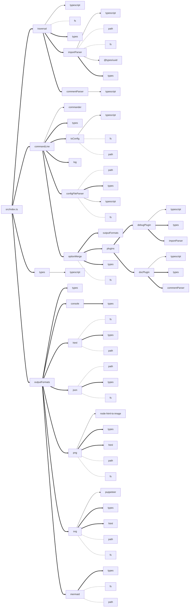

```mermaid
graph LR
root[src/index.ts] ==> ad1c87eb-91dd-4317-a27c-cf5909632d5b[traversal]
ad1c87eb-91dd-4317-a27c-cf5909632d5b[traversal] --> 16d60509-5674-48d0-a9e4-1378f8f7380d[typescript]
ad1c87eb-91dd-4317-a27c-cf5909632d5b[traversal] -.- b95494fe-b95a-4ee6-9bc5-063195c2f9e7[fs]
ad1c87eb-91dd-4317-a27c-cf5909632d5b[traversal] ==> efaf774f-1add-4e80-9a0b-3d920fe185be[types]
ad1c87eb-91dd-4317-a27c-cf5909632d5b[traversal] ==> c9f2a99d-c624-4b28-b21c-aa3621aecd63[importParser]
c9f2a99d-c624-4b28-b21c-aa3621aecd63[importParser] --> 264da130-2af3-4721-85fa-89df68732b7e[typescript]
c9f2a99d-c624-4b28-b21c-aa3621aecd63[importParser] -.- f2c39f5f-9d82-45c9-85e3-fd8709f26285[path]
c9f2a99d-c624-4b28-b21c-aa3621aecd63[importParser] -.- 4743015e-0c29-4cc9-a80a-a0887b0df6a5[fs]
c9f2a99d-c624-4b28-b21c-aa3621aecd63[importParser] --> c0eda5e6-84f4-41bc-b68b-2ce519c40e36[#64;types/uuid]
c9f2a99d-c624-4b28-b21c-aa3621aecd63[importParser] ==> 12741f37-7fc5-4f59-bdb0-670908df08fe[types]
ad1c87eb-91dd-4317-a27c-cf5909632d5b[traversal] ==> 5b00f9ae-2310-4203-91a2-7e2e57cb4df5[commentParser]
5b00f9ae-2310-4203-91a2-7e2e57cb4df5[commentParser] --> f8513653-99dc-4f7b-99d6-407cd7b71939[typescript]
root[src/index.ts] ==> 8b12da04-e980-4e6d-92a8-3593bbc6ffd0[commandLine]
8b12da04-e980-4e6d-92a8-3593bbc6ffd0[commandLine] --> ad74edc3-685d-4c6f-a3f3-9dbab00913ed[commander]
8b12da04-e980-4e6d-92a8-3593bbc6ffd0[commandLine] ==> ed4a8d87-ad3d-42a1-b909-2233b96bf918[types]
8b12da04-e980-4e6d-92a8-3593bbc6ffd0[commandLine] ==> b309c968-6866-4fa0-8c7e-205994e10525[tsConfig]
b309c968-6866-4fa0-8c7e-205994e10525[tsConfig] --> c89190e0-b0b1-4495-8511-22ebf8eb0a32[typescript]
b309c968-6866-4fa0-8c7e-205994e10525[tsConfig] -.- cd56b6ef-bf60-47a7-8ae8-994c5b7a0c4c[fs]
b309c968-6866-4fa0-8c7e-205994e10525[tsConfig] -.- 7e256c38-5370-421b-b10c-78564f88e953[path]
8b12da04-e980-4e6d-92a8-3593bbc6ffd0[commandLine] ==> bdcd020a-0134-4e9b-9336-6b98905eff8d[log]
8b12da04-e980-4e6d-92a8-3593bbc6ffd0[commandLine] ==> 374fbded-de1a-4345-bc17-96adfe0a374e[configFileParser]
374fbded-de1a-4345-bc17-96adfe0a374e[configFileParser] -.- 96c19439-4e6f-431d-a6a8-93b6a134b169[path]
374fbded-de1a-4345-bc17-96adfe0a374e[configFileParser] ==> 3d26318a-5cd9-4083-92ad-3eb224ec4be1[types]
374fbded-de1a-4345-bc17-96adfe0a374e[configFileParser] --> 30f73b82-fc2d-484b-9675-bf63392defed[typescript]
374fbded-de1a-4345-bc17-96adfe0a374e[configFileParser] -.- d52204c7-285a-4127-9f3c-ecfab107d087[fs]
8b12da04-e980-4e6d-92a8-3593bbc6ffd0[commandLine] ==> 1133cd7c-327c-4af4-a20a-b0a5abe860e7[optionMerge]
1133cd7c-327c-4af4-a20a-b0a5abe860e7[optionMerge] ==> 054020cb-cca0-4bbe-9c10-007b0d2fea5a[outputFormats]
1133cd7c-327c-4af4-a20a-b0a5abe860e7[optionMerge] ==> 451a183f-7529-4003-b352-3d008bcd6eb6[plugins]
451a183f-7529-4003-b352-3d008bcd6eb6[plugins] ==> 413a0df7-9b42-43b2-8f72-475ea462b807[debugPlugin]
413a0df7-9b42-43b2-8f72-475ea462b807[debugPlugin] --> 4cb25280-4ef5-4dd0-bf31-d1ac389b3a66[typescript]
413a0df7-9b42-43b2-8f72-475ea462b807[debugPlugin] ==> f47fe80c-64bf-4557-813b-734ad5d0bd86[types]
413a0df7-9b42-43b2-8f72-475ea462b807[debugPlugin] ==> 0058faf5-e30a-4496-a4f9-c9e9153e9bc4[importParser]
451a183f-7529-4003-b352-3d008bcd6eb6[plugins] ==> 5c0b2c2d-3812-4120-bf11-c935406aed0d[docPlugin]
5c0b2c2d-3812-4120-bf11-c935406aed0d[docPlugin] --> 8ccf0431-a42f-4a83-83c0-3f94fb8d4936[typescript]
5c0b2c2d-3812-4120-bf11-c935406aed0d[docPlugin] ==> 244f61c2-a7e2-4abf-a780-7d9505eb6feb[types]
5c0b2c2d-3812-4120-bf11-c935406aed0d[docPlugin] ==> 739bdfcf-75b8-4bd7-8ece-bee21305e379[commentParser]
1133cd7c-327c-4af4-a20a-b0a5abe860e7[optionMerge] ==> 2f69b4a8-fdf7-4bfb-98c6-7db975e9d595[types]
1133cd7c-327c-4af4-a20a-b0a5abe860e7[optionMerge] -.- 6792910b-6ead-437a-9d30-f18e19b2f80d[fs]
root[src/index.ts] ==> 9f22bb00-e99a-4485-8c25-5f5c70d31def[types]
9f22bb00-e99a-4485-8c25-5f5c70d31def[types] --> 7022f457-5afa-4cde-b097-9fb2ce4e2fb7[typescript]
root[src/index.ts] ==> f758e9e9-1de3-4428-9283-cbb0826e9094[outputFormats]
f758e9e9-1de3-4428-9283-cbb0826e9094[outputFormats] ==> 662bf355-806d-4c99-b9e0-f9a525fc86f7[types]
f758e9e9-1de3-4428-9283-cbb0826e9094[outputFormats] ==> 5a692fa0-ee7f-41c2-9c3a-bfe0dfcd05a2[console]
5a692fa0-ee7f-41c2-9c3a-bfe0dfcd05a2[console] ==> 3bb62273-18bd-4e93-b2da-e71695318047[types]
f758e9e9-1de3-4428-9283-cbb0826e9094[outputFormats] ==> 0c02c716-74c8-4b13-b8f2-495ed5537780[html]
0c02c716-74c8-4b13-b8f2-495ed5537780[html] -.- 0c973fa1-374a-4115-8c13-3d10d9230a76[fs]
0c02c716-74c8-4b13-b8f2-495ed5537780[html] ==> a5309aff-cd92-4d42-9fb3-483cdc069692[types]
0c02c716-74c8-4b13-b8f2-495ed5537780[html] -.- ee9dae52-daf5-495a-8df9-a18dee815609[path]
f758e9e9-1de3-4428-9283-cbb0826e9094[outputFormats] ==> fd37621f-6791-4db0-b5a1-45f918dbe327[json]
fd37621f-6791-4db0-b5a1-45f918dbe327[json] -.- 5a26879b-8012-40e4-8faa-ead2e06f28b0[path]
fd37621f-6791-4db0-b5a1-45f918dbe327[json] ==> 318edc17-c147-4228-b752-fdb91ebdc413[types]
fd37621f-6791-4db0-b5a1-45f918dbe327[json] -.- 48652d75-cc97-4daf-a85d-7e32122dc08c[fs]
f758e9e9-1de3-4428-9283-cbb0826e9094[outputFormats] ==> fc29ae60-3326-4d9b-ba0c-b3025b6e04b3[png]
fc29ae60-3326-4d9b-ba0c-b3025b6e04b3[png] --> ccf9ec27-3317-4a6e-acf7-3645012869ee[node-html-to-image]
fc29ae60-3326-4d9b-ba0c-b3025b6e04b3[png] ==> 037786cb-be8d-4e36-b8ee-d240e9a354fe[types]
fc29ae60-3326-4d9b-ba0c-b3025b6e04b3[png] ==> cb0618f1-7284-45bf-ba42-936faf217012[html]
fc29ae60-3326-4d9b-ba0c-b3025b6e04b3[png] -.- 65ccf94d-09fd-4477-bfc4-01d72f063932[path]
fc29ae60-3326-4d9b-ba0c-b3025b6e04b3[png] -.- 99be9141-4d00-4a8e-8872-1093dc53796a[fs]
f758e9e9-1de3-4428-9283-cbb0826e9094[outputFormats] ==> e4b3efc4-c91a-44f8-8dd1-ede496957f3c[svg]
e4b3efc4-c91a-44f8-8dd1-ede496957f3c[svg] --> c245e9e8-a03c-44d2-852f-248cd33471d7[puppeteer]
e4b3efc4-c91a-44f8-8dd1-ede496957f3c[svg] ==> 77e93fcf-3e35-4371-aae2-8a0af0278be0[types]
e4b3efc4-c91a-44f8-8dd1-ede496957f3c[svg] ==> d71fa773-12bf-4777-8f18-7e8b183835ba[html]
e4b3efc4-c91a-44f8-8dd1-ede496957f3c[svg] -.- a3195eca-5b51-4973-93ed-b331dc36422c[path]
e4b3efc4-c91a-44f8-8dd1-ede496957f3c[svg] -.- 0e552f66-8db1-43e4-803f-4eee1ebfa0df[fs]
f758e9e9-1de3-4428-9283-cbb0826e9094[outputFormats] ==> 5cf4f4d2-64ec-4780-b139-ccdaee45d56f[mermaid]
5cf4f4d2-64ec-4780-b139-ccdaee45d56f[mermaid] ==> 58ccaf54-8574-49b5-b2b1-436bbe7bfda7[types]
5cf4f4d2-64ec-4780-b139-ccdaee45d56f[mermaid] -.- de450458-cb50-4fea-ad7c-d6ac3c5caad1[fs]
5cf4f4d2-64ec-4780-b139-ccdaee45d56f[mermaid] -.- b86da0b6-e14b-4b9c-bd9e-56dcdfe68d57[path]
```