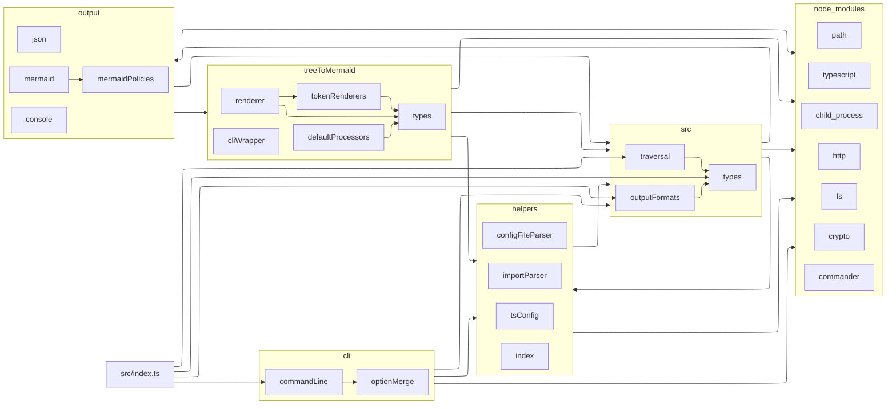

```mermaid
---
config:
  layout: elk
  theme: default
---
graph LR
root["src/index.ts"]
subgraph src
97436aa4caaa9fe6c1f7fbda54bea5c5["traversal"]
152b731d9960fa8a94d223c73a70437c["types"]
1fe092282d1f404a83c6dfaa449427eb["outputFormats"]
end
subgraph node_modules
ee253c483834accc136016fd0cfda308["typescript"]
bc7b36fe4d2924e49800d9b3dc4a325c["fs"]
d6fe1d0be6347b8ef2427fa629c04485["path"]
5ae9b7f211e23aac3df5f2b8f3b8eada["crypto"]
590e227ecebc0951e8994717b1bc8669["commander"]
6bdd121cf07238ae4acd0de370dd13bf["child_process"]
80791b3ae7002cb88c246876d9faa8f8["http"]
end
subgraph helpers
89368ad2b907401c75ac83d0c8f51150["importParser"]
333f22f566da67b693a352a010116a59["tsConfig"]
3fb28eb5baf18d345d0ad93d7e341109["configFileParser"]
ef9f86388078e0560db65509eefba48d["index"]
end
subgraph cli
6eabf6036c1cd8aaca6f56d1c8fb63e0["commandLine"]
e414dc75f5dcbe2827116d5050a8c6fa["optionMerge"]
end
subgraph output
7029e3f6954c28b14ceaef910bc2c07b["console"]
1cdc6bd921f66f50622b5c56a23a8d72["json"]
3c9aeb9e1a663982bf18432623f081c0["mermaid"]
02be73a92c1e73068fee3f6a5570552a["mermaidPolicies"]
end
subgraph treeToMermaid
5fc5c7f77b9094999991e4a88935bbc8["renderer"]
ba94a21f1b99f22bcbee495161be6017["tokenRenderers"]
43b2c294408e9aca405ff8cc04120742["types"]
a7c2c5aebf261da9ed0ec6111e63d2d3["defaultProcessors"]
45fc45c3c3ddc9a6a05b8fa52cbd234c["cliWrapper"]
end
root root_97436aa4caaa9fe6c1f7fbda54bea5c5@--> 97436aa4caaa9fe6c1f7fbda54bea5c5
src src_node_modules@--> node_modules
97436aa4caaa9fe6c1f7fbda54bea5c5 97436aa4caaa9fe6c1f7fbda54bea5c5_152b731d9960fa8a94d223c73a70437c@--> 152b731d9960fa8a94d223c73a70437c
src src_helpers@--> helpers
helpers helpers_node_modules@--> node_modules
helpers helpers_src@--> src
root root_6eabf6036c1cd8aaca6f56d1c8fb63e0@--> 6eabf6036c1cd8aaca6f56d1c8fb63e0
cli cli_node_modules@--> node_modules
cli cli_src@--> src
cli cli_helpers@--> helpers
6eabf6036c1cd8aaca6f56d1c8fb63e0 6eabf6036c1cd8aaca6f56d1c8fb63e0_e414dc75f5dcbe2827116d5050a8c6fa@--> e414dc75f5dcbe2827116d5050a8c6fa
root root_152b731d9960fa8a94d223c73a70437c@--> 152b731d9960fa8a94d223c73a70437c
root root_1fe092282d1f404a83c6dfaa449427eb@--> 1fe092282d1f404a83c6dfaa449427eb
1fe092282d1f404a83c6dfaa449427eb 1fe092282d1f404a83c6dfaa449427eb_152b731d9960fa8a94d223c73a70437c@--> 152b731d9960fa8a94d223c73a70437c
src src_output@--> output
output output_src@--> src
output output_node_modules@--> node_modules
output output_treeToMermaid@--> treeToMermaid
treeToMermaid treeToMermaid_helpers@--> helpers
5fc5c7f77b9094999991e4a88935bbc8 5fc5c7f77b9094999991e4a88935bbc8_ba94a21f1b99f22bcbee495161be6017@--> ba94a21f1b99f22bcbee495161be6017
ba94a21f1b99f22bcbee495161be6017 ba94a21f1b99f22bcbee495161be6017_43b2c294408e9aca405ff8cc04120742@--> 43b2c294408e9aca405ff8cc04120742
5fc5c7f77b9094999991e4a88935bbc8 5fc5c7f77b9094999991e4a88935bbc8_43b2c294408e9aca405ff8cc04120742@--> 43b2c294408e9aca405ff8cc04120742
treeToMermaid treeToMermaid_src@--> src
a7c2c5aebf261da9ed0ec6111e63d2d3 a7c2c5aebf261da9ed0ec6111e63d2d3_43b2c294408e9aca405ff8cc04120742@--> 43b2c294408e9aca405ff8cc04120742
treeToMermaid treeToMermaid_node_modules@--> node_modules
3c9aeb9e1a663982bf18432623f081c0 3c9aeb9e1a663982bf18432623f081c0_02be73a92c1e73068fee3f6a5570552a@--> 02be73a92c1e73068fee3f6a5570552a

```