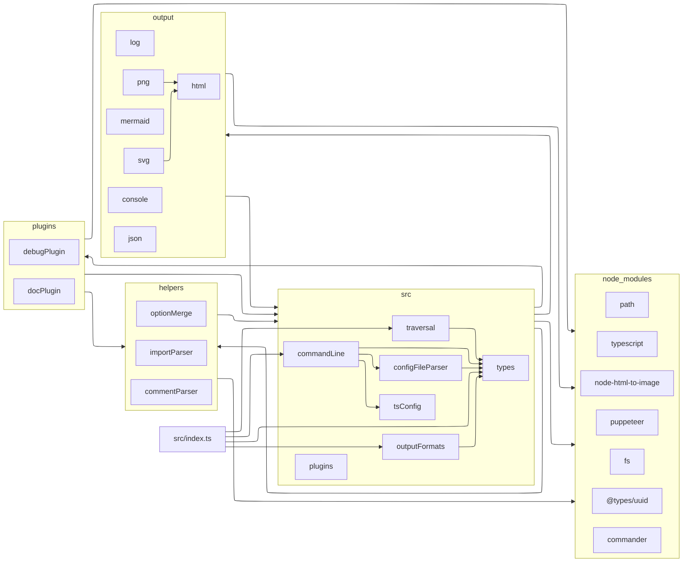

At the time of writing elk is not enabled in github: https://github.com/orgs/community/discussions/138426

```mermaid
---
config:
  layout: elk
  theme: default
---
%%{ init: { "flowchart": { "defaultRenderer": "elk" } } }%%
graph LR
63a9f0ea7bb98050796b649e85481845["src/index.ts"]
subgraph src
97436aa4caaa9fe6c1f7fbda54bea5c5["traversal"]
152b731d9960fa8a94d223c73a70437c["types"]
bf7ee236f4e6b888c001cb0608bc49c6["commandLine"]
5dc29212635cb6c3999e3980a8b3abce["tsConfig"]
3484b233dcf339f61e886b8c7ca4c47c["configFileParser"]
1fe092282d1f404a83c6dfaa449427eb["outputFormats"]
d96bfb07f3011687d3234f953a2d3861["plugins"]
end
subgraph node_modules
ee253c483834accc136016fd0cfda308["typescript"]
bc7b36fe4d2924e49800d9b3dc4a325c["fs"]
d6fe1d0be6347b8ef2427fa629c04485["path"]
20725b2c82ab26e2ff65c383dcb8af6d["@types/uuid"]
590e227ecebc0951e8994717b1bc8669["commander"]
660ad68f5b95885609cd57ba3bdf39ef["node-html-to-image"]
0742e241c07c7470dbed6671089f6fda["puppeteer"]
end
subgraph helpers
89368ad2b907401c75ac83d0c8f51150["importParser"]
3a8232373e2696c001fba4ed00d99bab["commentParser"]
b23f7d5cb0a63c8189c7c62a5ecc769c["optionMerge"]
end
subgraph output
cdfec58517a7dda26151ab6daf185742["log"]
7029e3f6954c28b14ceaef910bc2c07b["console"]
0db6041ec8d2e82f5e9c6db8fd8a97bc["html"]
1cdc6bd921f66f50622b5c56a23a8d72["json"]
9fbed50a45fceb27d386ff54167b51bb["png"]
3ea04c08e90c63ab428b8ddc0fa72e1a["svg"]
3c9aeb9e1a663982bf18432623f081c0["mermaid"]
end
subgraph plugins
c250edc428d53f672f415354da48dd5f["debugPlugin"]
f0e3388660feabf39302f54c44eb57af["docPlugin"]
end
63a9f0ea7bb98050796b649e85481845 link_b9be11166d72e9e3ae7fd407165e4bd20693d2cfa83e02d11bcef46140396258@--> 97436aa4caaa9fe6c1f7fbda54bea5c5
src link_25d902c24283ab8cfbac54dfa101ad313ec03583f8eaec275cb2183db769ff47@--> node_modules
97436aa4caaa9fe6c1f7fbda54bea5c5 link_0693d2cfa83e02d11bcef461403962587babdcc381cf7fec712e98f9481b2d38@--> 152b731d9960fa8a94d223c73a70437c
src link_25d902c24283ab8cfbac54dfa101ad31c2c3081275569a523f7b887c77722c5b@--> helpers
helpers link_c2c3081275569a523f7b887c77722c5b3ec03583f8eaec275cb2183db769ff47@--> node_modules
helpers link_c2c3081275569a523f7b887c77722c5b25d902c24283ab8cfbac54dfa101ad31@--> src
63a9f0ea7bb98050796b649e85481845 link_b9be11166d72e9e3ae7fd407165e4bd2a4df04e5ead292da9cdc6f8d822b5859@--> bf7ee236f4e6b888c001cb0608bc49c6
bf7ee236f4e6b888c001cb0608bc49c6 link_a4df04e5ead292da9cdc6f8d822b58597babdcc381cf7fec712e98f9481b2d38@--> 152b731d9960fa8a94d223c73a70437c
bf7ee236f4e6b888c001cb0608bc49c6 link_a4df04e5ead292da9cdc6f8d822b5859a93464a3818130ce2011b11b378d03ee@--> 5dc29212635cb6c3999e3980a8b3abce
src link_25d902c24283ab8cfbac54dfa101ad3178e6221f6393d1356681db398f14ce6d@--> output
bf7ee236f4e6b888c001cb0608bc49c6 link_a4df04e5ead292da9cdc6f8d822b58591b769ebe55b19a4b9297226b102fa183@--> 3484b233dcf339f61e886b8c7ca4c47c
3484b233dcf339f61e886b8c7ca4c47c link_1b769ebe55b19a4b9297226b102fa1837babdcc381cf7fec712e98f9481b2d38@--> 152b731d9960fa8a94d223c73a70437c
src link_25d902c24283ab8cfbac54dfa101ad3163dc9087c660611bdf3fcb1a1257247a@--> plugins
plugins link_63dc9087c660611bdf3fcb1a1257247a3ec03583f8eaec275cb2183db769ff47@--> node_modules
plugins link_63dc9087c660611bdf3fcb1a1257247a25d902c24283ab8cfbac54dfa101ad31@--> src
plugins link_63dc9087c660611bdf3fcb1a1257247ac2c3081275569a523f7b887c77722c5b@--> helpers
63a9f0ea7bb98050796b649e85481845 link_b9be11166d72e9e3ae7fd407165e4bd27babdcc381cf7fec712e98f9481b2d38@--> 152b731d9960fa8a94d223c73a70437c
63a9f0ea7bb98050796b649e85481845 link_b9be11166d72e9e3ae7fd407165e4bd2ff8f4de61bd100a11555e12a851a1720@--> 1fe092282d1f404a83c6dfaa449427eb
1fe092282d1f404a83c6dfaa449427eb link_ff8f4de61bd100a11555e12a851a17207babdcc381cf7fec712e98f9481b2d38@--> 152b731d9960fa8a94d223c73a70437c
output link_78e6221f6393d1356681db398f14ce6d25d902c24283ab8cfbac54dfa101ad31@--> src
output link_78e6221f6393d1356681db398f14ce6d3ec03583f8eaec275cb2183db769ff47@--> node_modules
9fbed50a45fceb27d386ff54167b51bb link_e413dc9e6e52dd0831ad18ec588436f9f100e1a59469f5507e4cdf95fcf5a9aa@--> 0db6041ec8d2e82f5e9c6db8fd8a97bc
3ea04c08e90c63ab428b8ddc0fa72e1a link_3bfc0fdfc874f62d18bf2ca7743b8b6cf100e1a59469f5507e4cdf95fcf5a9aa@--> 0db6041ec8d2e82f5e9c6db8fd8a97bc

```
